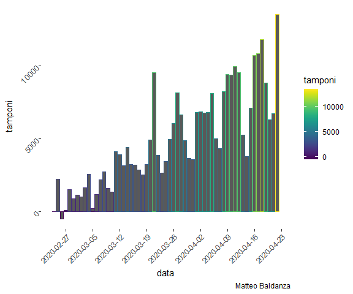
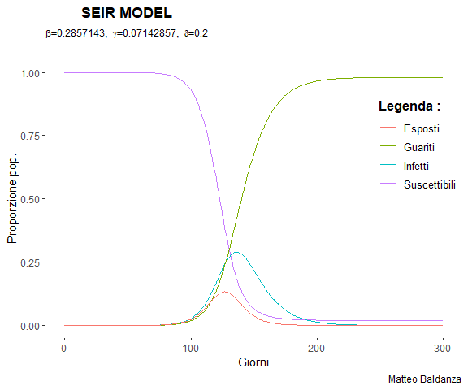

Alcuni errori di lettura sul Coronavirus
================
Matteo Baldanza

**Questo articolo nasce al solo scopo informativo**

### INTRODUZIONE

In data 30/03/2020 Tgcom24 ha pubblicato un articolo riguardante uno
studio sul coranavirus condotto da Einaudi Institute For Economics and
Finance. Questo studio prevedeva che in data odierna, 22/04/2020 i nuovi
positivi sul territorio lombardo sarebbero stati pari a 0(Riporto il
link
<https://www.tgcom24.mediaset.it/cronaca/coronavirus-lombardia-verso-i-contagi-zero-il-22-aprile-ecco-le-previsioni-regione-per-regione_16728763-202002a.shtml>).

Nella data di pubblicazione mi sono accorto di un errore grave commesso
da tale istituto nello studio effettuato. Spiegato in maniera veloce
l’errore consiste nella scelta dei dati inappropriata,ovvero sono
stati utilizzati numeri che non hanno alcuna rilevanza di tipo
statistico. Il problema forse/immagino nasce dall’errore della stessa
protezione civile(fonte di propagazione dei dati sul virus) nel calcolo
dei veri valori dei nuovi casi positivi.In tali infatti non venivano
considerati deceduti e guariti, andando cosi a sottostimare i veri
valori(la settimana precedente il calcolo è stato cambiato e corretto).
Lo studio quindi pubblicato su Tgcom24 è stato fin dal primo istante una
“fake news”.

Si decide di pubblicare questo articolo in data 22/04/2020 in quanto
oggi si può effettivamente dire che lo studio è stato irrilevante e
sebben si possano considera gli intervalli di confidenza all’interno
della curva per prolungare l’effettiva data di azzeramento, rimane
comunque un lavoro inadeguato.

A tal proposito con questo breve report si è voluto indagare sulla
situazione della malattia in Lombardia.

### INIZIALIZZAZIONE DATI

``` r
dat_csv<-read.csv("https://raw.githubusercontent.com/pcm-dpc/COVID-19/master/dati-regioni/dpc-covid19-ita-regioni.csv",header=T)
days<-dim(dat_csv)[1]
colnames(dat_csv)
```

    FALSE  [1] "data"                       "stato"                     
    FALSE  [3] "codice_regione"             "denominazione_regione"     
    FALSE  [5] "lat"                        "long"                      
    FALSE  [7] "ricoverati_con_sintomi"     "terapia_intensiva"         
    FALSE  [9] "totale_ospedalizzati"       "isolamento_domiciliare"    
    FALSE [11] "totale_positivi"            "variazione_totale_positivi"
    FALSE [13] "nuovi_positivi"             "dimessi_guariti"           
    FALSE [15] "deceduti"                   "totale_casi"               
    FALSE [17] "tamponi"                    "casi_testati"              
    FALSE [19] "note_it"                    "note_en"

``` r
dat_csv$t<-1:days
days
```

    FALSE [1] 1239

``` r
myDateTimeStr1 <- dat_csv$data
myDateTimeStr1= gsub("T"," ",myDateTimeStr1)
myPOSIXct1 <- as.POSIXct(myDateTimeStr1, format="%Y-%m-%d %H:%M:%S")
days_dy<-as.Date(myPOSIXct1)
dat_csv$data=days_dy
dat_csv=dat_csv %>%
  filter(denominazione_regione=="Lombardia")%>%
  mutate(casi=totale_casi-deceduti-dimessi_guariti)
dat_csv$totale_ospedalizzati
```

    FALSE  [1]    95   104   104   213   282   336   512   605   865  1086  1413  1931
    FALSE [13]  2020  2616  3242  3785  4412  4852  5085  5630  6267  6994  7832  8209
    FALSE [25]  8393  8785  9351 10581 10449 10905 11262 11944 12429 12471 12941 13145
    FALSE [37] 13207 13269 13113 13183 13328 13326 13257 13138 12976 13032 13079 13200
    FALSE [49] 13145 13171 13199 13117 12388 11598 10989 11264 11039 10656 10509

``` r
diff=function(colonna) {
  diff=colonna[2:length(colonna)]-colonna[1:(length(colonna)-1)]
  return(c(0,diff))
}
colnames(dat_csv)
```

    FALSE  [1] "data"                       "stato"                     
    FALSE  [3] "codice_regione"             "denominazione_regione"     
    FALSE  [5] "lat"                        "long"                      
    FALSE  [7] "ricoverati_con_sintomi"     "terapia_intensiva"         
    FALSE  [9] "totale_ospedalizzati"       "isolamento_domiciliare"    
    FALSE [11] "totale_positivi"            "variazione_totale_positivi"
    FALSE [13] "nuovi_positivi"             "dimessi_guariti"           
    FALSE [15] "deceduti"                   "totale_casi"               
    FALSE [17] "tamponi"                    "casi_testati"              
    FALSE [19] "note_it"                    "note_en"                   
    FALSE [21] "t"                          "casi"

``` r
dat_csv$totale_ospedalizzati
```

    FALSE  [1]    95   104   104   213   282   336   512   605   865  1086  1413  1931
    FALSE [13]  2020  2616  3242  3785  4412  4852  5085  5630  6267  6994  7832  8209
    FALSE [25]  8393  8785  9351 10581 10449 10905 11262 11944 12429 12471 12941 13145
    FALSE [37] 13207 13269 13113 13183 13328 13326 13257 13138 12976 13032 13079 13200
    FALSE [49] 13145 13171 13199 13117 12388 11598 10989 11264 11039 10656 10509

``` r
cumsum(dat_csv$totale_ospedalizzati)
```

    FALSE  [1]     95    199    303    516    798   1134   1646   2251   3116   4202
    FALSE [11]   5615   7546   9566  12182  15424  19209  23621  28473  33558  39188
    FALSE [21]  45455  52449  60281  68490  76883  85668  95019 105600 116049 126954
    FALSE [31] 138216 150160 162589 175060 188001 201146 214353 227622 240735 253918
    FALSE [41] 267246 280572 293829 306967 319943 332975 346054 359254 372399 385570
    FALSE [51] 398769 411886 424274 435872 446861 458125 469164 479820 490329

``` r
totale_ricoverati=dat_csv$totale_ospedalizzati[2:length(dat_csv$data)]-dat_csv$totale_ospedalizzati[1:(length(dat_csv$data)-1)]+dat_csv$deceduti[-1]+dat_csv$dimessi_guariti[-1]
dat_csv$totale_ospedalizzati=c(0,totale_ricoverati)
dat_csv$totale_ospedalizzati=diff(dat_csv$totale_ospedalizzati)
```

### ANDAMENTO REALE

Per prima cosa si descrive la situazione tramite visualizzazione dei
dati. Oggi all’interno della regione Lombardia la curva dei contagi è la
seguente:

``` r
ggplot(dat_csv)+
  geom_line(size=1,col="tan1",aes(y=totale_positivi,x=data))+
  labs(title = "Lombardia",subtitle = "Confronto",caption = "Matteo Baldanza")+
  scale_x_date(breaks="7 days")+
  theme(axis.text.x = element_text(angle=45,hjust=1))
```

<!-- -->

Ieri per la prima volta è stata raggiunto un numero negativo di nuovi
casi. Questo risultato ci indica che il numero dei positivi e dimessi è
stato per la prima volta maggiore/uguale ai nuovi contagi. Il picco
della curva è quindi stato toccato.

### ANDAMENTO POSITIVI E RICOVERI GIORNALIERI

I dati forniti dalla protezione civile non includono i ricoveri
giornalieri ma solo il numero degli ospedalizzati ogni giorno. Si è
pensato quindi di ricavare tale informazione in questo modo :
\[RICOVERATI \: = \:differenza \: ospedalizzati \: + \: dimessi + \: morti\]

Il risultato è il seguente :

``` r
ggplot(dat_csv)+
  geom_line(size=1,aes(y=nuovi_positivi,x=data,colour="Positivi giornalieri"))+
  geom_smooth(aes(y=nuovi_positivi,x=data),col="black",se = F)+
  geom_line(size=1,aes(y=totale_ospedalizzati,x=data,colour="Ricoveri giornalieri"))+
  geom_smooth(aes(y=totale_ospedalizzati,x=data),col="black",se=F)+
  labs(title = "Lombardia",subtitle = "Confronto",y="Count",caption = "Matteo Baldanza")+
  scale_x_date(breaks="7 days")+
  scale_colour_manual("", 
                      breaks = c("Positivi giornalieri", "Ricoveri giornalieri"),
                      values = c("red","green4"))+
  theme(axis.text.x = element_text(angle=45,hjust=1))+
  geom_hline(yintercept=0, size=1,color="tan1",linetype="dashed")+
  theme(legend.justification=c(1,0), legend.position=c(1.0,0.7))
```

    ## `geom_smooth()` using method = 'loess' and formula 'y ~ x'
    ## `geom_smooth()` using method = 'loess' and formula 'y ~ x'

<!-- -->

Queste due curve rappresentano le serie storiche dei positivi/ricoveri.
La linea arancione tratteggiata indica lo 0 . Le curve in nero sono
regressioni di tipo loess,non parametriche, che stimano l’andamento nel
tempo dei dati che non è del tutto incoraggiante. Si può notare come si
è ben distanti dal raggiungimento dei nuovi positivi nulli.

### ANALISI TAMPONI

Come ultimo commento si analizzano il numero dei tampo effettuati
giornalmente. Negli ultimi giorni si dice che ultimamente i tamponi
effettuati sono in continuo aumento ed effettivamente è vero :

``` r
dat_csv$tamponi=diff(dat_csv$tamponi)
ggplot(dat_csv)+
  geom_bar(stat="identity",aes(y=tamponi,x=data,col=tamponi),inherit.aes = F)+
  scale_x_date(breaks="7 days")+
  scale_color_viridis(discrete = F, option = "D")+
  theme(axis.text.x = element_text(angle=45,hjust=1),axis.text.y = element_text(angle=45,hjust=1,size = 10))+
  labs(caption = "Matteo Baldanza")
```

<!-- -->

Quello che però non viene detto è che questi dati,che sono quelli
comunicati quotidianamente,non rappresentano il vero numero di nuovi
tamponi. Includono infatti anche quelli effettuati sugli individui
infetti che obbligatoriamente devono effettuare dopo due settimane il
test di negatività al COVID-19. Affermare quindi che i nuovi casi
positivi in relazione all’aumento dei tamponi indichino un abbassamento
dei casi è ancora una volta del tutto privo di verità.

### UNA DATA INDICATIVA D’INIZIO DELLE INFEZIONI

Ancora oggi non si conosce quando tutto sia iniziato o forse non ci è
stato ancora comunicato. Una risposta può essere trovata stimando un
modello epidemiologico di tipo SEIR. Tale modello stastico descrive la
diffusione di una qualsiasi infezione che abbia un periodo di
incubazione e quindi rappresenta meglio la situazione attuale.Per essere
utilizzato ha bisogno di alcuni input che sono stati scelti in questa
maniera :

1.  \(R_0\) , indice di persone medio che un individuo infetto può
    infettare. Stimato con un IC=(2,5) si è scelto di utilizzare
    \(R_0\)=4

2.  Il periodo di incubazione.In questo caso sono stati scelti 5
    giorni(rappresenta una media)

3.  Periodo di infettività di un individuo.A tal propositvo si è scelto
    14 giorni(rappresenta una media)

4.  Popolazione Lombarda=10.04\*10^6

5.  Numero di infettati al giorno 0 pari a 10. E’ presumibile che
    l’infettato zero sia arrivato in lombardia tramite un aereo e che
    quindi abbia nel frattempo infettato altri individui

<!-- end list -->

``` r
N_Lombardia=10.04*10^6
R0=4
Incubazione=5
Periodo_infetto=14
gamma=1/Periodo_infetto #recovered rate
sigma=1/Incubazione 
beta=gamma*R0 
beta
```

    ## [1] 0.2857143

Ove beta rappresenta la probabilità di un individuo di infettarne un
altro.

A questo punto si può stimare il modello che risulta :

``` r
seir_model = function (current_timepoint, state_values, parameters)
{
  S = state_values [1]        # susceptibles
  E = state_values [2]        # exposed
  I = state_values [3]        # infectious
  R = state_values [4]        # recovered
  
  with ( 
    as.list (parameters),     
    {
      
      dS = (-beta * S * I)
      dE = (beta * S * I) - (delta * E)
      dI = (delta * E) - (gamma * I)
      dR = (gamma * I)
      
      
      results = c (dS, dE, dI, dR)
      list (results)
    }
  )
}
parameter_list = c (beta = beta, gamma = gamma, delta=sigma)
W = N_Lombardia-1       
Y = 0     
Z = 0     
X = 10
N = W + X + Y + Z
initial_values = c (S = W/N, E = X/N, I = Y/N, R = Z/N)
timepoints = seq (0, 300, by=1)
output = lsoda (initial_values, timepoints, seir_model, parameter_list)
title <- bquote("SEIR MODEL")
subtit <- bquote(list(beta==.(parameter_list[1]),~gamma==.(parameter_list[2]),~delta==.(parameter_list[3])))
output=as.data.frame(output)
seir<-ggplot(output,aes(x=time))+
  ggtitle(bquote(atop(bold(.(title)),atop(bold(.(subtit))))))+
  geom_line(aes(y=S,colour="Suscettibili"))+
  geom_line(aes(y=I,colour="Infetti"))+
  geom_line(aes(y=R,colour="Guariti"))+
  geom_line(aes(y=E,colour="Esposti"))+
  ylab(label="Proporzione pop.")+
  xlab(label="Giorni")+
  labs(color="Legenda : ",caption = "Matteo Baldanza")+
theme(legend.justification=c(1,0), legend.position=c(1,0.5))+
  theme(legend.title=element_text(size=12,face="bold"),
        legend.background = element_rect(fill='#FFFFFF',
                                         size=0.5,linetype="solid"),
        legend.text=element_text(size=10))
  
  
seir
```

<!-- -->

Quello che possiamo concludere è :

1.  Il picco di infetti si raggiunge circa al 130/140 giorno, il che
    vuol dire che il virus stando al modello(non esprime verità
    assoluta\!) sia arrivato nel territorio lombardo nel periodo di
    dicembre/gennaio

2.  Le persone infettate se non fossero state prese precauzioni come la
    quarantena sarebbero state circa il 25% della popolazione
    lombarda(si stima che ora gli infetti siano il 10%)
